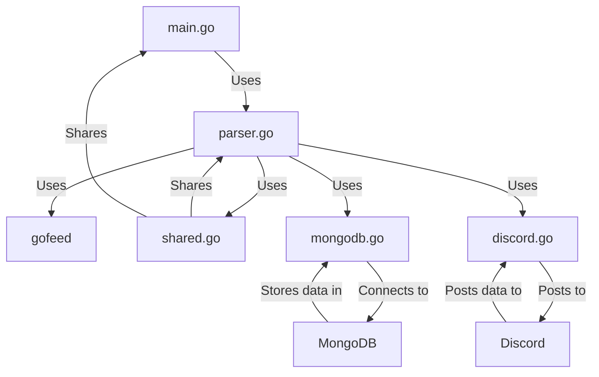

```mermaid
graph TD;
    A[main.go] -->|Uses| B[parser.go]
    B -->|Uses| C[gofeed]
    B -->|Uses| D[shared.go]
    B -->|Uses| E[mongodb.go]
    B -->|Uses| F[discord.go]
    D -->|Shares| B
    D -->|Shares| A
    E -->|Connects to| G[MongoDB]
    F -->|Posts to| H[Discord]
    G -->|Stores data in| E
    H -->|Posts data to| F
```
